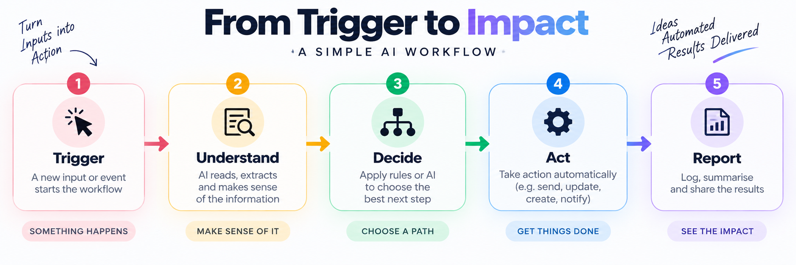

# AI Workflow Builder Guide - Claude × n8n

  

> Build practical AI automations with Claude and n8n — without starting from a blank canvas.

This repository contains the companion materials for the **AI Workflow Builder Guide — Claude × n8n**.

## What is inside?

- `GUIDE.md` - the complete beginner-friendly guide
- `workflows/` - practical workflow examples and build notes
- `assets/` - visual assets used by the guide
- `PUBLISHING.md` - notes for publishing the guide and implementing a review-before-download gate

## The core model

  

**Trigger → Understand → Decide → Act → Report**

The goal is to design the process first, then use Claude and n8n to implement it.

## Examples included

### 1. Small-business enquiry triage
A new enquiry is classified, routed, stored and surfaced to the right person.

### 2. The Signal content pipeline
A topic or article becomes a structured content brief with research fields, multiple content angles and a human review step before publication.

## Important

The workflows are learning examples. Add validation, credentials management, retries, duplicate checks, and human approval where appropriate before using them in production.

## Guide

Read the full guide in [`GUIDE.md`](./GUIDE.md).

## Author

Henry Williams — AI automation, data, emerging technology and creator workflows.

GitHub: https://github.com/officialHW
